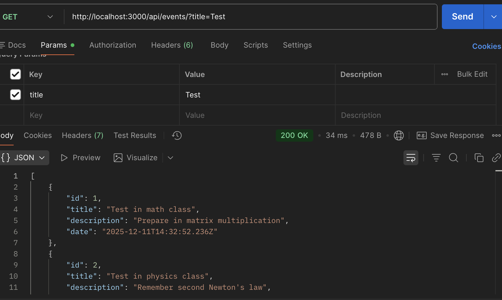
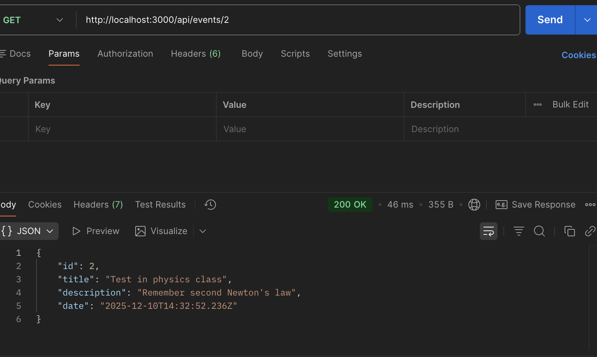
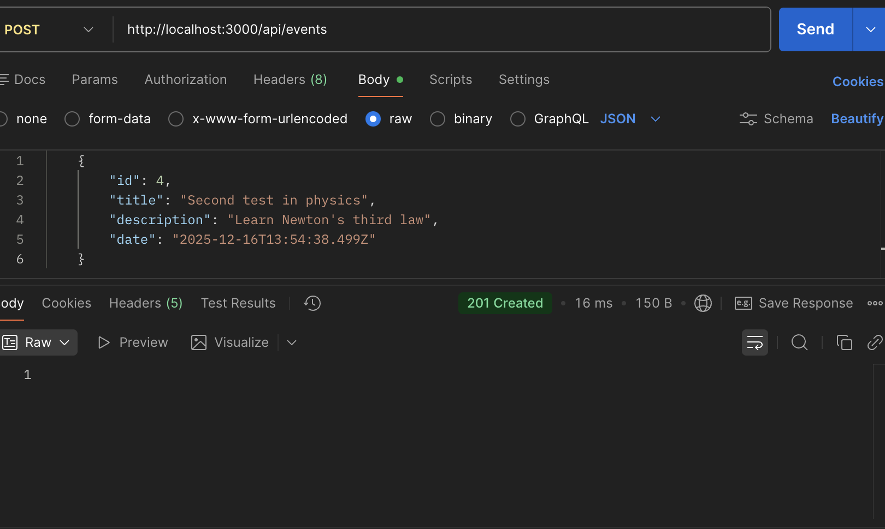
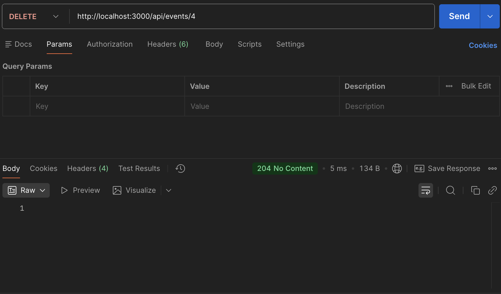

# Test 5 in technology of industrial programming course

## Что сделано

- базовый express server
- роуты GET, POST, PUT, DELETE
- работа с параметрами (req.parms.id) и query (req.query.title)
- обработка запроса через express.json() и middleware logger
- разнесенная логика по папкам

### Routes

